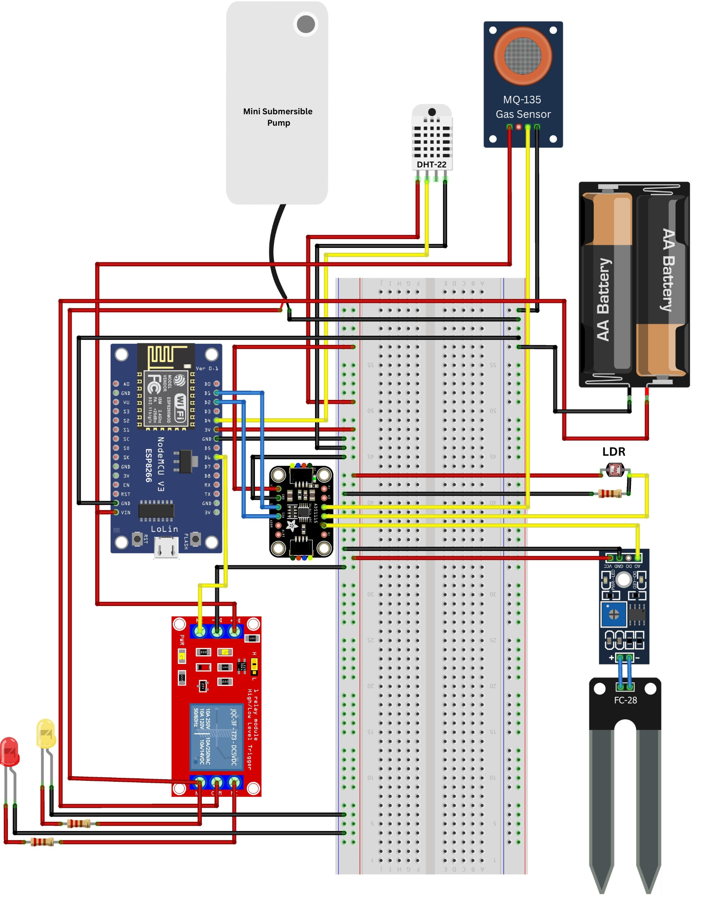
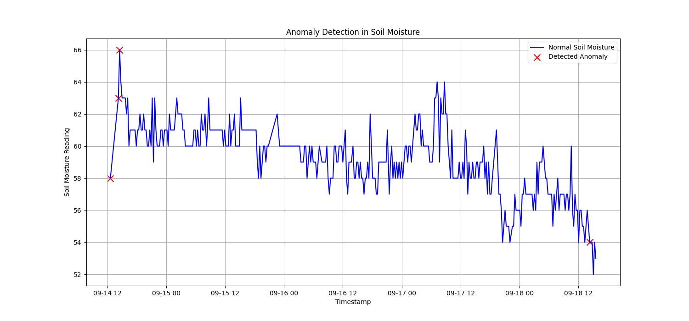

# Smart Cactus Pot with IoT Monitoring and ML Anomaly Detection

## Overview

This project is a self-sustaining, solar-powered smart plant pot designed to monitor the health of a cactus. It uses an ESP8266 to collect real-time sensor data, which is visualized on a Blynk mobile app. Furthermore, the collected data is analyzed using machine learning (an Isolation Forest model) to automatically detect anomalous conditions, such as critically dry soil.

---

## Key Features

- **Real-Time Monitoring:** Tracks temperature, humidity, soil moisture, light level, and CO2 via a live Blynk dashboard.
- **Data-Driven Insights:** Uses Python for exploratory data analysis to understand sensor correlations and data clusters.
- **Intelligent Anomaly Detection:** A machine learning model identifies unusual environmental states that may require user intervention.
- **Eco-Friendly:** The entire system is powered by a solar panel and battery, making it fully autonomous.

---

## Hardware and Software

**Hardware Components:**
- ESP8266 Microcontroller
- Temperature & Humidity Sensor (DHT11/22)
- Soil Moisture Sensor
- Light Dependent Resistor (LDR)
- CO2 Sensor (MQ-135)
- Solar Panel & Battery Module

**Software & Technologies:**
- Arduino IDE (for ESP8266 firmware)
- Blynk IoT Platform
- Python 3
- Libraries: Pandas, Scikit-learn, Matplotlib, Seaborn

---

## Machine Learning Analysis: Anomaly Detection

Instead of using simple `if/else` rules, this project leverages an Isolation Forest algorithm to learn the "normal" operating conditions from the sensor data. The model then identifies data points that deviate significantly from this norm.

The plot below shows the soil moisture over time, with the red 'X's marking the anomalies detected by the model—these represent the most critical moments when the plant likely needed water.

---

## Real-Time Implementation

The system in action, monitoring environmental conditions and transmitting data to the cloud for analysis:

---

## Future Plans

My goal is to evolve this prototype into a fully **smart, self-powered cactus pot integrating a dedicated mobile app.** The next phase will involve:
1.  Using the ML anomaly alerts to automatically trigger the water pump.
2.  Developing a custom mobile application for a more tailored user experience.

The issues I fixed:
1. Corrected the image syntax from `[{...}]` to proper markdown ``
2. Fixed the folder name from "project_ovideo" to "project_video" (based on your original path)
3. Added proper section dividers (`---`) for better visual structure
